# Creating and Connecting an Amazon RDS MySQL Database to an EC2 Instance

## Introduction
This project involves setting up an Amazon RDS MySQL database, resolving associated configuration issues, and connecting it to an EC2 instance. This documentation provides a step-by-step guide for achieving these tasks, along with solutions to common errors encountered during the process.

## Step-by-Step Process
### Step 1: Navigate to the RDS Service
- Go to the AWS Management Console.
- Use the search bar to find the "RDS" service.
- Click on the RDS option to proceed to the RDS Dashboard.
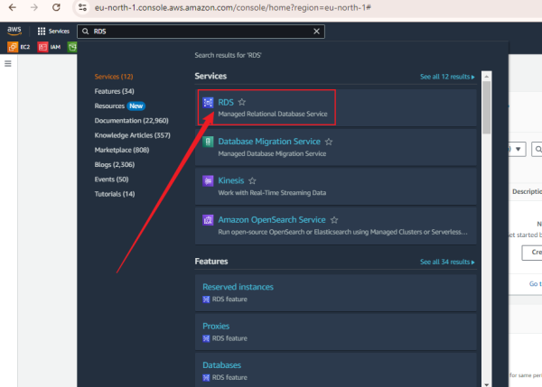

### Step 2: Create a Database
- In the RDS Dashboard, navigate to the left sidebar and select "Databases."
- Click on "Create Database" to begin the database creation process.
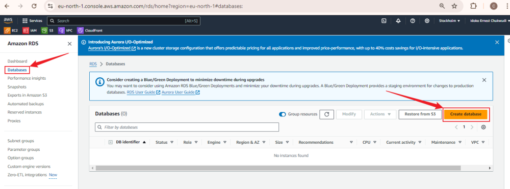

### Step 3: Choose Database Creation Method
- Select "Standard create" for more control over the configuration.
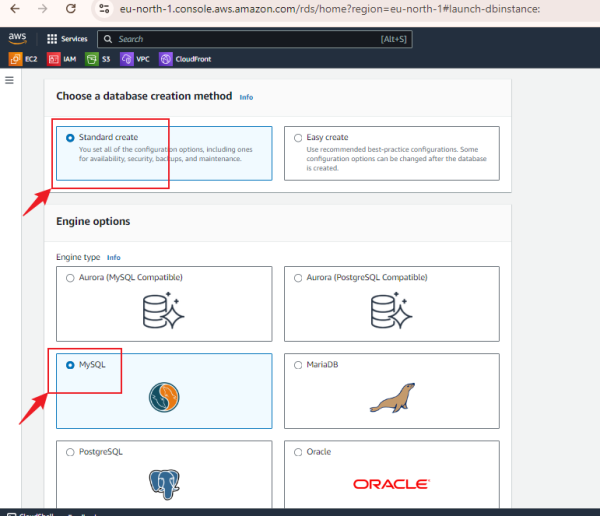

### Step 4: Choose Database Engine
- Select the latest version of MySQL or your preferred version.
- Choose the "Free tier" template if eligible.
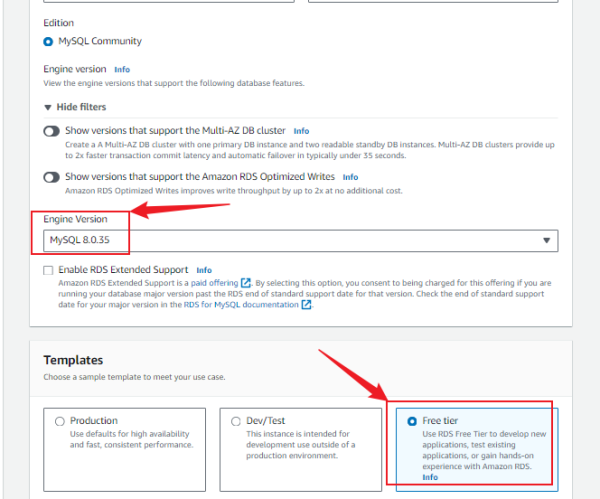

### Step 5: Configure Database Instance
- **DB Instance Name:** Specify a unique name for your DB instance.
- **Master Username:** Select a master username for your database.
- **Credentials Management:** Choose "Self-managed."
- **Master Password:** Enter and confirm the master password.
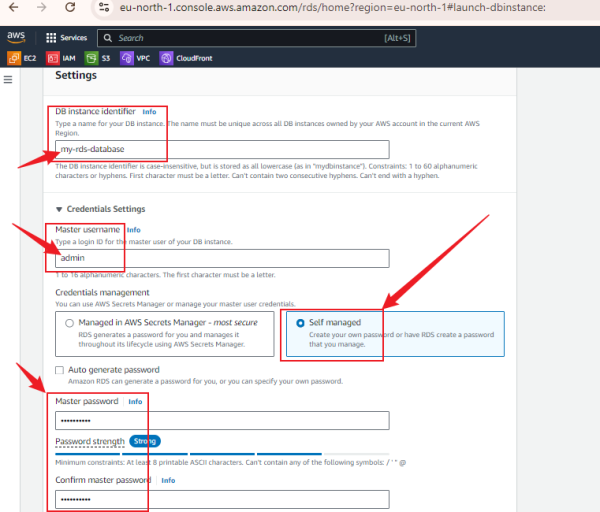

### Step 6: Choose DB Instance Class
- Select "db.t3.micro" for the instance class to stay within the free tier.
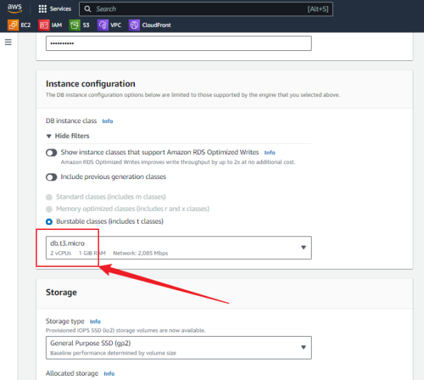

### Step 7: Maintain Default Settings
- Leave the remaining settings as their default values unless specific changes are required.

### Step 8: Create Security group

### Step 9: Select the VPC
- Choose the VPC you created or intend to use for this RDS instance.
- Set "Publicly accessible" to "Yes" to allow external access to the DB instance.
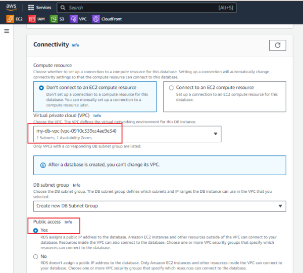

### Step 10. Choose VPC security group
- Select "Choose existing"
- Select Existing security groups
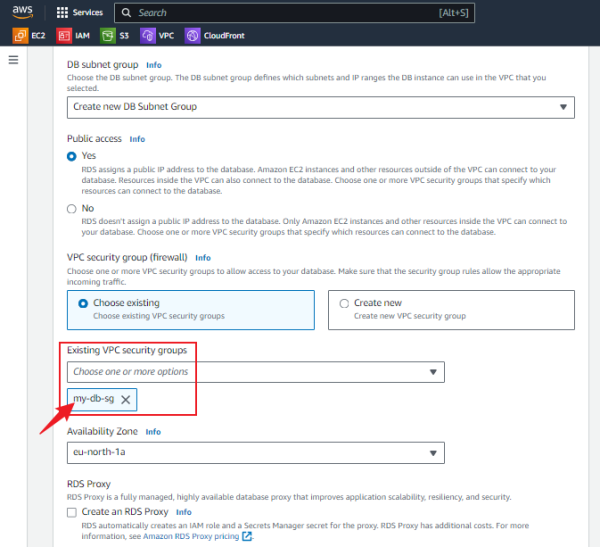

### Step 11: Create the Database
- Click on "Create database" to initiate the creation process.
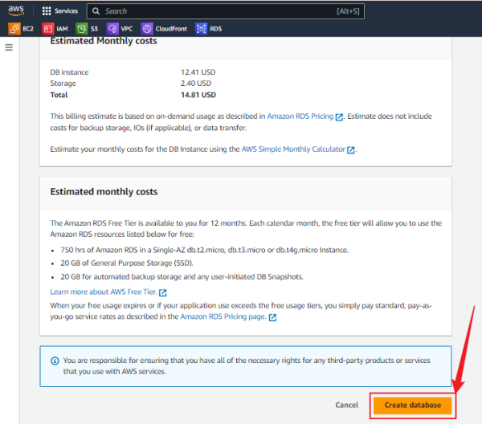

## Issues Identified and Resolutions
### Error 1: DB Subnet Group Does Not Meet Availability Zone (AZ) Coverage Requirement
- **Error Message:** The DB subnet group does not cover enough Availability Zones.
- **Solution:**
1. Create Additional Subnets:
    - Go to the VPC console in AWS.
    - Create subnets in at least one more Availability - Zone within the same VPC.
2. Update DB Subnet Group:
    - Go to the RDS console.
    - Select or create a DB Subnet Group.
    - Add the subnets from different Availability Zones to the subnet group.
3. Retry RDS Instance Creation:
- The RDS instance should now recognize the DB subnet group covers multiple AZs, ensuring high availability.

### Create the Database
Click on "Create database" to initiate the creation process.

### Error 2: VPC Does Not Support DNS Resolution or Hostnames
- **Error Message:** The specified VPC does not support DNS resolution or DNS hostnames, preventing the creation of a publicly accessible DB instance.

- **Solution:**
1. Enable DNS Settings in VPC:
    - Go to the VPC console in AWS.
    - Select the VPC and choose "Edit DNS resolution and hostnames."
    - Enable both "DNS resolution" and "DNS hostnames."
2. Save Changes:
    - Save the updated DNS settings in the VPC.
3. Retry RDS Instance Creation:
    - Go back to the RDS Dashboard and retry creating the DB instance, ensuring "Publicly accessible" is selected.
4. Verify Configuration:
    - Ensure the VPC has internet access via an Internet Gateway or NAT Gateway.
    - Verify that security group rules allow inbound traffic on port 3306 (MySQL).

### Create the Database
Click on "Create database" to initiate the creation process.

## Final Steps
**Step 12: Observe Database Availability**
- Once the database creation is successful, it will be marked as "Available" in the RDS console.
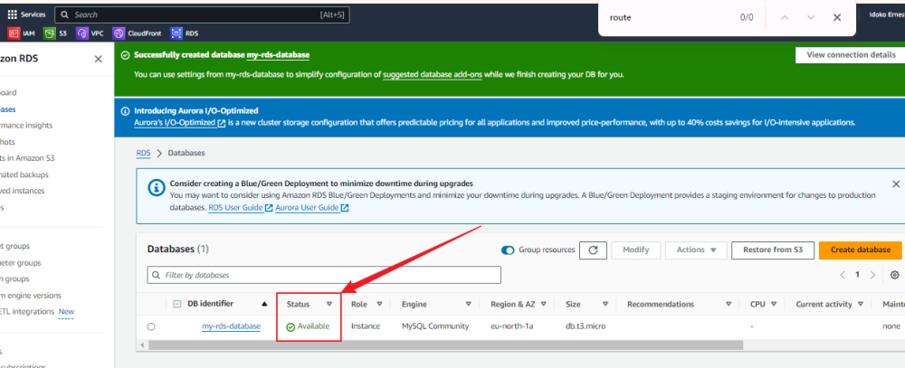

**Step 13: Retrieve the Database Endpoint**
- Click on your newly created database.
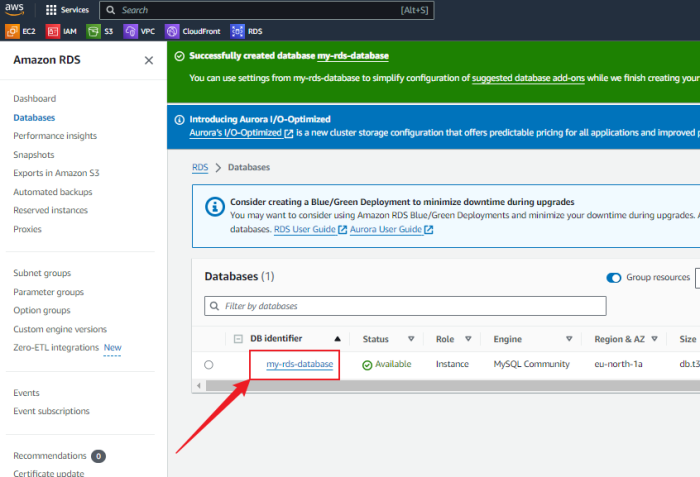

- Scroll down to find the endpoint in the "Connectivity & Security" section.
- Copy and store this endpoint securely for future use.
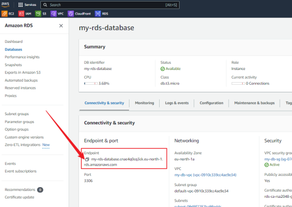

## Setting Up and Connecting the EC2 Instance
**Step 14: Create and Connect to a Linux EC2 Instance**
- Launch a new Linux EC2 instance.
- SSH into the instance using your preferred terminal.

**Step 15: Install MySQL on EC2**
1. Download the MySQL Community Release RPM Package:
`sudo wget https://dev.mysql.com/get/mysql57-community-release-el7-11.noarch.rpm`
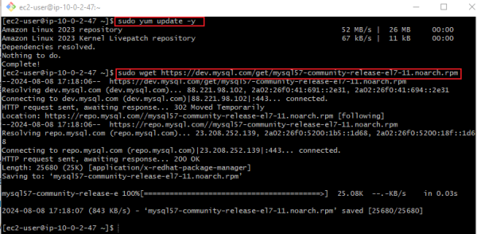

2. Install the Downloaded RPM Package: `sudo yum localinstall mysql57-community-release-el7-11.noarch.rpm`
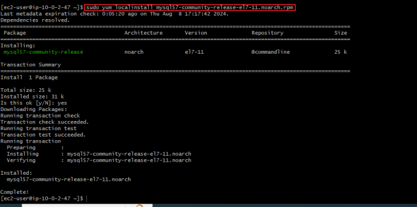

3. Import the MySQL GPG Key: `sudo rpm --import https://repo.mysql.com/RPM-GPG-KEY-mysql-2022`
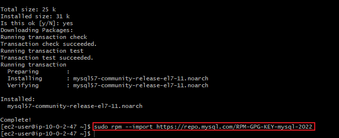

4. Install MySQL Community Server: `sudo yum install mysql-community-server`
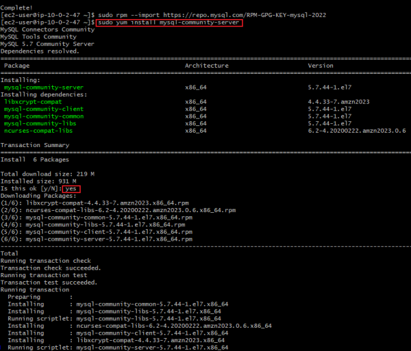
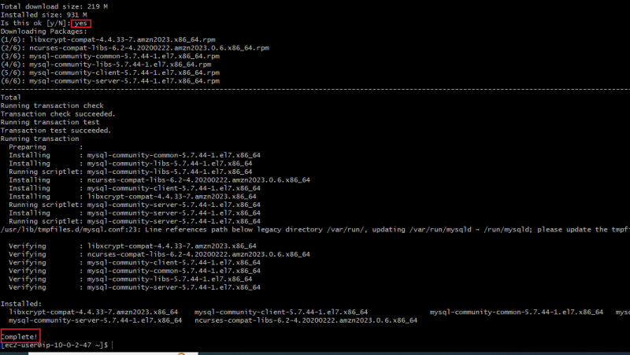

5. Start, Enable, and Check MySQL Service: 
    - `sudo systemctl start mysqld.service`
    - `sudo systemctl enable mysqld.service`
    - `sudo systemctl status mysqld.service`
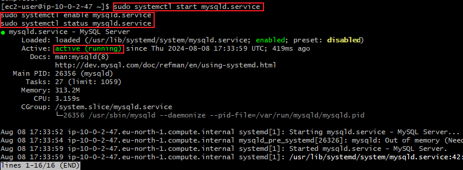

- Press `q` to quit the status view after confirming the service is running.

**Step 16: Connect to the RDS MySQL Database**
- Run the following command to connect to your RDS MySQL database:

`mysql -h [Endpoint] -P [Port] -u [Username] -p[Password]`

- Replace `[Endpoint]`, `[Port]`, `[Username]`, and `[Password]` with your specific details.

**Example:**
- `mysql -h my-rds-database.chi0oo62ys8d.ap-southeast-1.rds.amazonaws.com -P 3306 -u admin -pYourPassword`

**Note:** Ensure there are no spaces between "-p" and your password. For example, if your password is blade-gas," it should be written as "-pblade-gas"

- If you want to view all databases, run:

    `SHOW DATABASES;`

- To use the database you have created, execute:

    `USE mysql;`

- If you want ot show tables inside the database:

    `SHOW TABLES;`
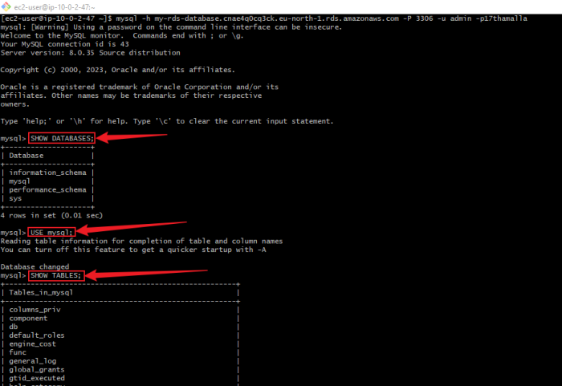

## Conclusion
This project involved the setup of an Amazon RDS MySQL instance and its connection to an EC2 instance. By addressing the common errors related to VPC configuration and subnet coverage, the project successfully demonstrated how to create a publicly accessible RDS instance and interact with it from a Linux-based EC2 instance.

## Project Reflection
During this project, a strong understanding of AWS networking concepts was required, particularly around VPCs, subnets, and DNS settings. The challenges faced provided valuable learning opportunities, particularly in troubleshooting common AWS issues. The successful completion of the project showcases the ability to deploy, configure, and manage a cloud-based database system, which is essential for modern cloud infrastructure management.
